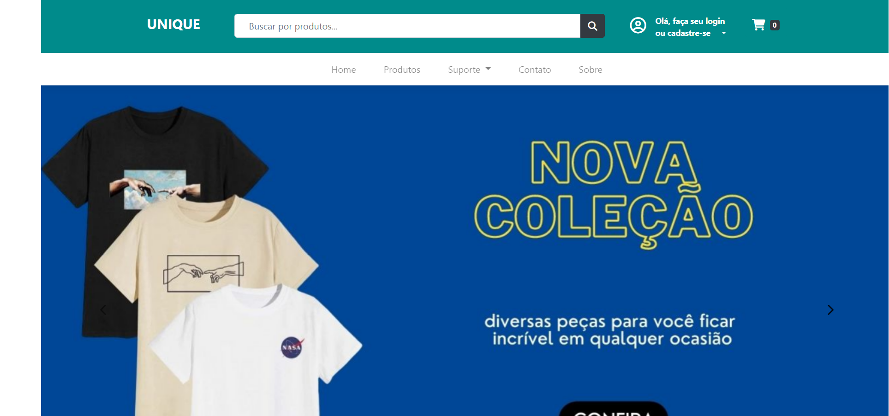
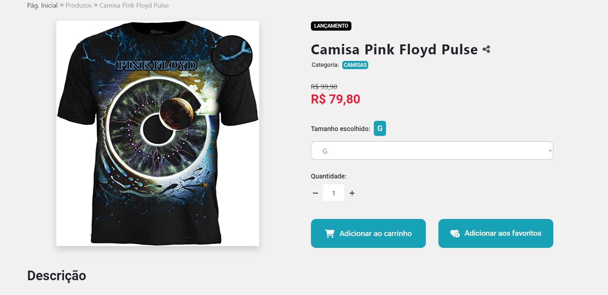
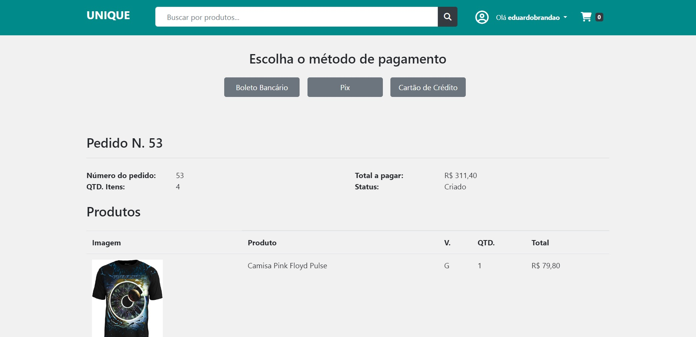

# App Clothes Store
Este repositório trata-se da de uma aplicação web simulando um e-commerce.

# APRESENTACAO
Construir uma aplicação web para que o usuário final seja capaz de:

- Visualizar o layout da pagina independente do tamanho da tela do dispositivo;
- Visualizar e ver mais detalhes do produto escolhido;
- Visualizar os produtos de acordo com a ordem escolhida;
- Adicionar ou remover a quantidade desejada de produtos no carrinho;
- Adicionar produtos a sua listas de favoritos personalizada;
- Ver seu histórico de pedidos;
- Realizar cadastro e login;
- Fazer buscas de modo geral ou por categoria;
- Encaminhar e-mail com sugestões e/ou críticas através da seção Sobre;

Construir uma aplicação web para que o funcionário do e-commerce seja capaz de:

- Adicionar ou remover produtos no banco de dados;
- Editar as características de cada produto;
- Verificar e atualizar status de Pedidos;
- Visualizar histórico de Pedidos;

# METODOLOGIA
Aplicação de conceitos em:

- Python
- Django
- HTML
- CSS
- Bootstrap
- JavaScript
- JQuery
- Layouts Responsivos
- Banco de Dados

# SCREENSHOTS DO PROJETO

# LINK DO PROJETO
Para visualizar o projeto no seu navegador utilize o link abaixo:

http://storeunique.herokuapp.com
